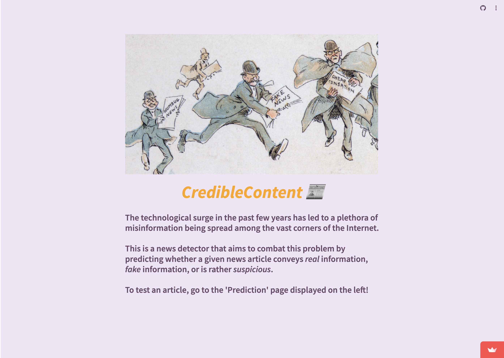
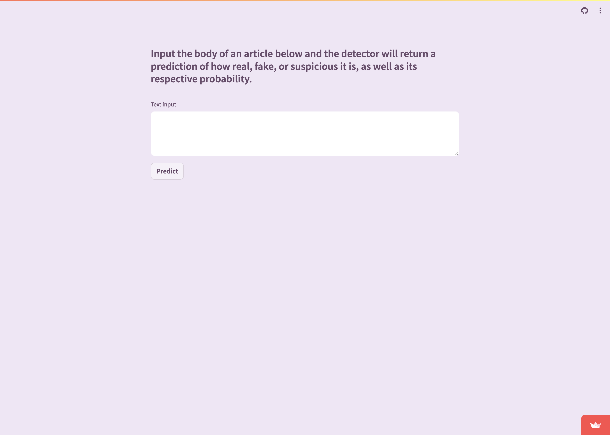
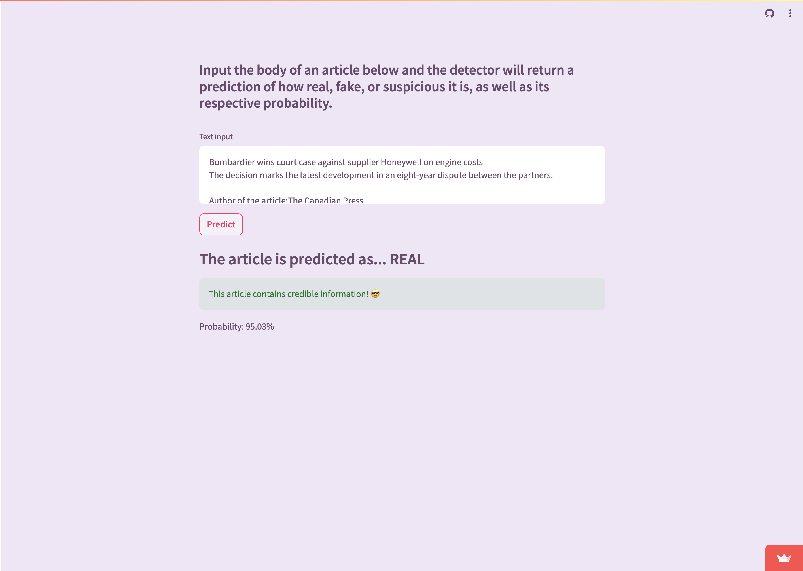
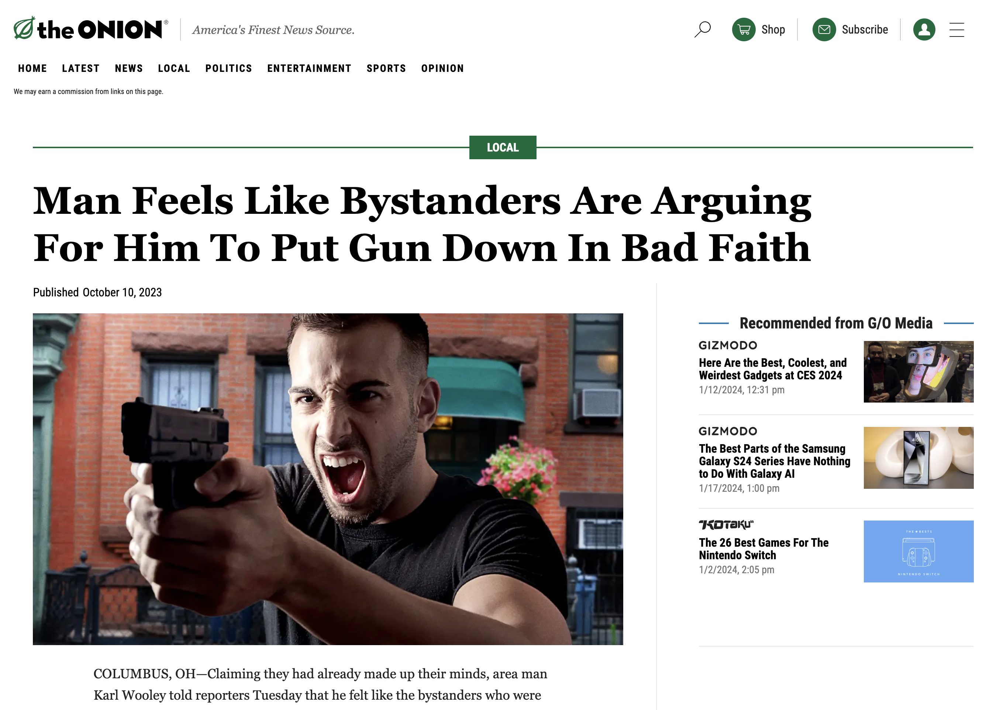
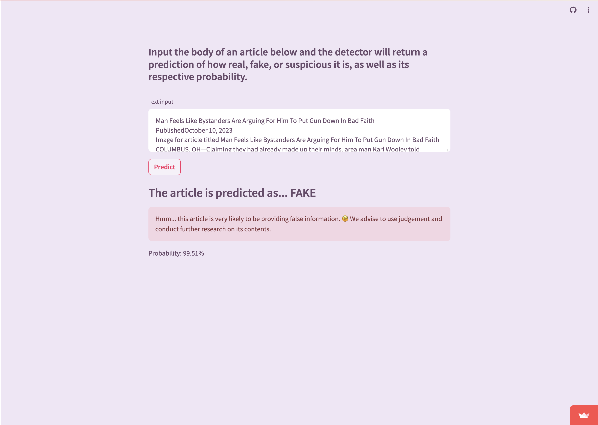

# Fake News Detector (CredibleContent)

In an age where AI-generated fake news is becoming increasingly sophisticated, our DistilBERT-powered Fake News Detector serves as a crucial shield against misinformation. Leveraging the efficiency and accuracy of the DistilBERT model, this project excels in identifying and filtering out deceptive content. It's specifically designed to adapt to the evolving nature of AI-generated text, ensuring a robust defense against the spread of falsehoods. This tool is essential for protecting individuals from the dangers of misinformation, ensuring they receive only trustworthy information. In a world where discerning truth from fiction is more challenging than ever, our Fake News Detector stands as a beacon of reliability and safety.

## Screenshots
### Home Page

### Text Input

### True Article (Gazette of Montreal)

### True Result (Gazette)

### Fake Article (The Onion)

### Fake Result (The Onion)

## Demo
Follow this link to try it yourself:
https://fake-news-detector-wagon.streamlit.app/

## Authors

- [@mariadryden](https://www.github.com/mariadryden)
- [@AbelKosh](https://www.github.com/AbelKosh)
- [@PQPHanna](https://www.github.com/PQPHanna)
